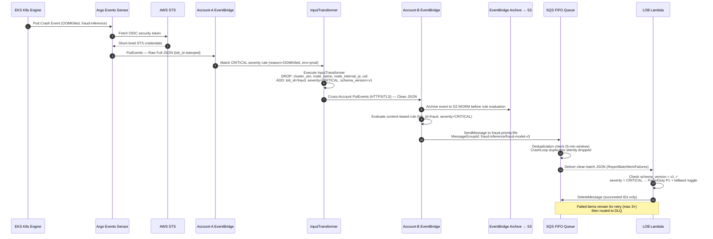
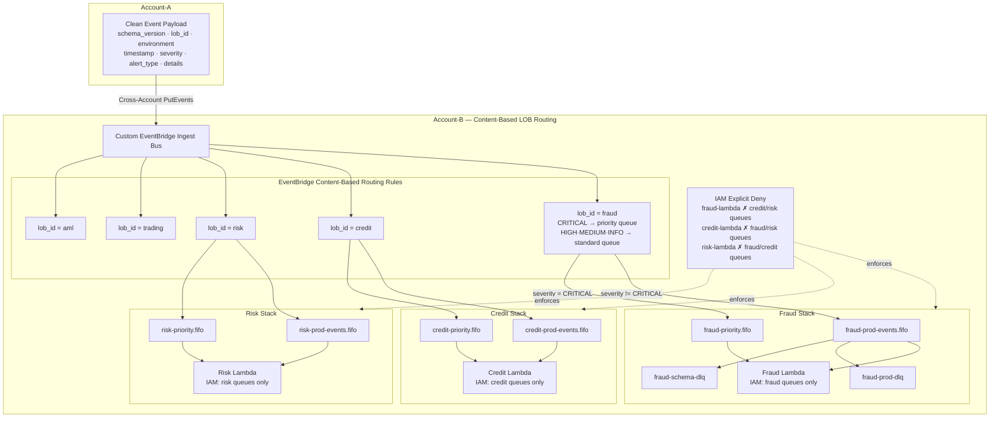
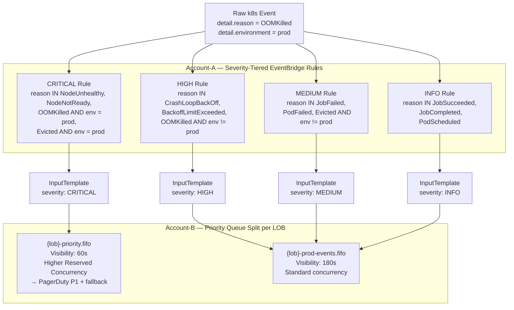
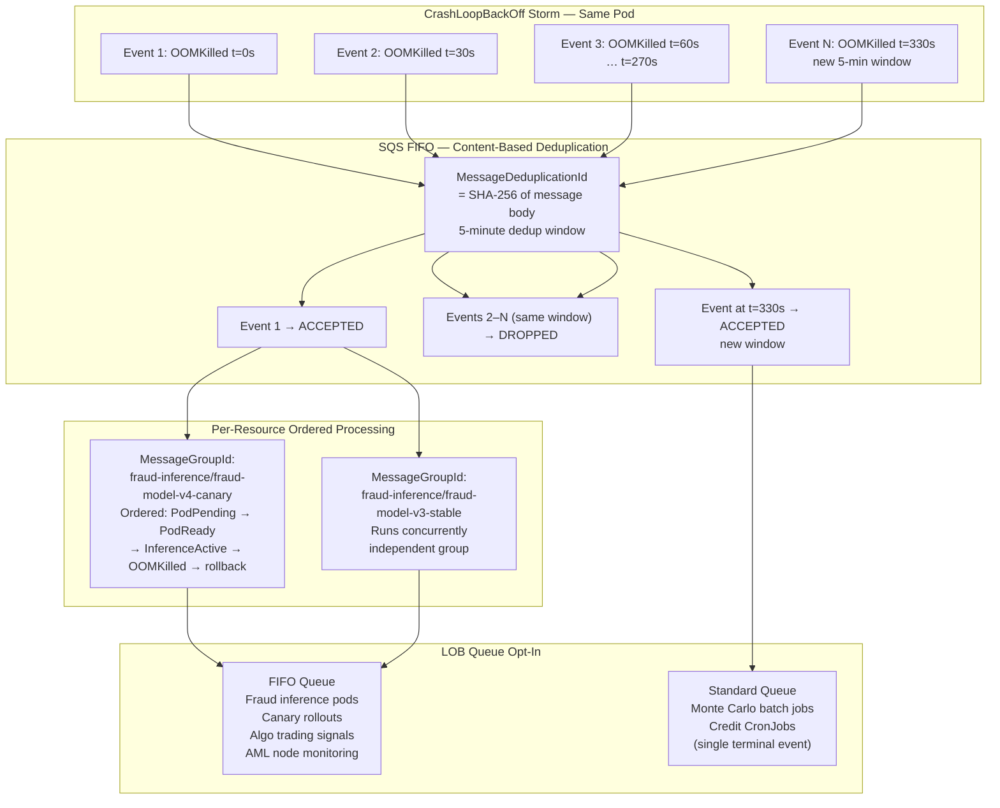
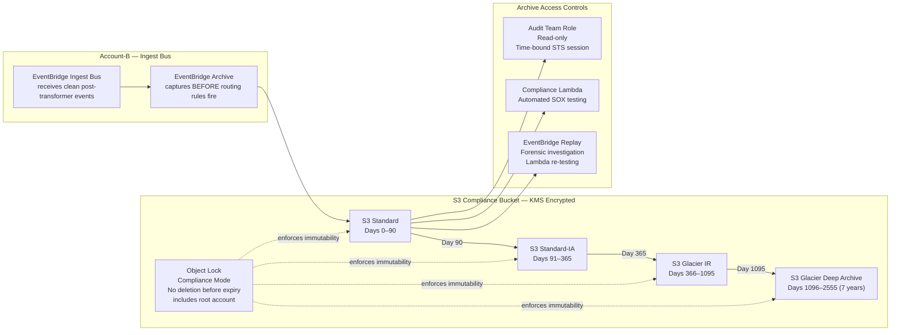
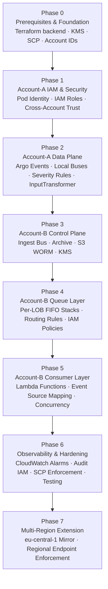

# Technical Design Document (TDD)

**System:** Cross-Account Enterprise Event Streaming & Telemetry Pipeline
**Classification:** Internal Cloud Architecture Specification
**Status:** Final

---

## Table of Contents

1. [Executive Summary & Business Value](#1-executive-summary--business-value)
2. [Architecture Overview](#2-architecture-overview)
3. [Structural Diagrams (C4 Model)](#3-structural-diagrams-c4-model)
4. [Component Technical Specification](#4-component-technical-specification)
5. [Architectural Evaluation: Trade-offs & Alternatives](#5-architectural-evaluation-trade-offs--alternatives)
6. [Cluster Admin View](#6-cluster-admin-view)
7. [LOB and Model Workload Use Cases](#7-lob-and-model-workload-use-cases)
8. [Architectural Gap Analysis and Resolutions](#8-architectural-gap-analysis-and-resolutions)
9. [Financial Services Risk and Compliance Layer](#9-financial-services-risk-and-compliance-layer)
10. [Phase-by-Phase Implementation Plan](#10-phase-by-phase-implementation-plan)

---

## 1. Executive Summary & Business Value

### Problem Statement

As organizations scale their Kubernetes footprints across multiple lifecycle stages, providing development teams and Lines of Business (LOBs) with granular visibility into cluster telemetry introduces significant challenges. Granting raw Kubernetes RBAC access to external consumers exposes internal topologies, complicates compliance auditing, and risks cluster security.

### Proposed Solution

This document specifies a multi-account, segregated Data Plane (Account-A) and Control Plane (Account-B) architecture. Kubernetes event-driven operators (Argo Events) capture cluster lifecycle events, which are scrubbed of all sensitive metadata, severity-classified, deduplicated, and dispatched to isolated per-LOB messaging queues with long-term compliance archival — using only native AWS primitives, requiring no custom middleware.

### Enterprise Value Proposition

- **Zero-Trust Access Model:** LOB applications consume data exclusively via Amazon SQS and AWS Lambda in the Control Plane. No external entity holds IAM access or network visibility into the Data Plane.
- **Per-LOB Data Isolation:** Each Line of Business consumes events from a dedicated SQS queue, enforced independently at EventBridge routing and IAM policy layers. Cross-LOB event access is architecturally impossible.
- **Operational Decoupling:** Platform engineers rotate, upgrade, or rebuild Kubernetes infrastructure in Account-A without coordinating with LOB teams or altering any consumer configuration in Account-B.
- **Immutable Audit Trail:** Events are archived to S3 with Object Lock (WORM) before any consumer processes them — 7-year retention satisfying SOX 404, MiFID II, and BSA/AML obligations.
- **Native Deduplication:** SQS FIFO content-based deduplication absorbs CrashLoopBackOff storms natively, producing at most one Lambda invocation per 5-minute window per unique event fingerprint — zero custom code.
- **Strict Cost Allocation:** The consumer layer runs entirely on event-driven serverless runtimes, with per-LOB queue isolation enabling exact cost attribution by line of business.

---

## 2. Architecture Overview

### System Boundaries

The system spans two AWS accounts separated by a hard organizational boundary:

| Account | Role | Key Components |
|---|---|---|
| **Account-A** | Data Plane | EKS clusters (named by LOB), Argo Events, local EventBridge buses, severity-tiered routing rules, InputTransformer sanitization layer |
| **Account-B** | Control Plane | Custom EventBridge ingest bus, EventBridge Archive, S3 WORM bucket, per-LOB content-based routing rules, per-LOB SQS FIFO queue stacks, LOB Lambda consumers |

### Data Flow Summary

```
EKS Cluster (Account-A)
  → Argo Events (stamps lob_id)
  → Local EventBridge Bus
  → Severity-Tiered Rule + InputTransformer
      [DROPS: cluster_arn, node_name, node_internal_ip, uid]
      [ADDS: lob_id, severity, schema_version]
  → Cross-Account PutEvents (HTTPS/TLS)
  → Account-B Ingest Bus
      → EventBridge Archive → S3 WORM (7-year)
      → LOB Content-Based Routing Rule
          → Per-LOB SQS FIFO Queue
              → LOB Lambda Consumer
```

### Clean Event Payload (What LOB Teams Receive)

```json
{
  "schema_version": "v1",
  "lob_id":         "fraud",
  "environment":    "prod",
  "timestamp":      "2026-06-14T16:45:10Z",
  "severity":       "CRITICAL",
  "alert_type":     "OOMKilled",
  "details": {
    "kind":      "Pod",
    "namespace": "fraud-inference",
    "name":      "fraud-model-v3-9d84f",
    "summary":   "Container limit reached. Rescheduling task."
  }
}
```

Fields permanently eliminated before crossing the organizational boundary: `cluster_arn`, `node_name`, `node_internal_ip`, `uid`, and all raw Kubernetes system metadata.

---

## 3. Structural Diagrams (C4 Model)

### 3.1 C4 Level 1 — System Context Diagram

```mermaid
flowchart LR
    subgraph AccountA["☁  Account-A — Data Plane (us-west-2)"]
        direction TB
        subgraph clusters["EKS Clusters — Named by LOB"]
            eks["fraud-prod-cluster\ncredit-prod-cluster\nrisk-prod-cluster\ntrading-prod-cluster\naml-prod-cluster"]
        end
        podid["EKS Pod Identity\nSTS Token via OIDC\nNo hardcoded keys"]
        argo["Argo Events\nEventSource + Sensor\nStamps lob_id per cluster"]
        subgraph buses["Local EventBridge Buses"]
            npbus["non-prod-telemetry-bus\nDev / QA / UAT"]
            pbus["prod-da-telemetry-bus\nDA / Prod"]
        end
        subgraph sev["Severity-Tiered Rules + InputTransformer"]
            rc["CRITICAL\nNodeUnhealthy, OOMKilled-prod"]
            rh["HIGH\nCrashLoopBackOff, BackoffLimitExceeded"]
            rm["MEDIUM\nJobFailed, PodFailed"]
            ri["INFO\nJobSucceeded, PodScheduled"]
        end
    end

    subgraph boundary["── Organizational Boundary · Cross-Account PutEvents (HTTPS / TLS) ──"]
    end

    subgraph AccountB["☁  Account-B — Control Plane (us-west-2)"]
        direction TB
        ingest["Custom EventBridge\nIngest Bus\nTLS-only · Account-A principal"]
        archive["EventBridge Archive\n→ S3 Object Lock WORM\n7-year retention"]
        subgraph routing["Content-Based LOB Routing Rules"]
            r1["lob_id = fraud"]
            r2["lob_id = credit"]
            r3["lob_id = risk · trading · aml …"]
        end
        subgraph queues["Per-LOB SQS FIFO Queue Stacks"]
            q1["fraud-prod.fifo + priority.fifo\n+ DLQ + Schema-DLQ"]
            q2["credit-prod.fifo + priority.fifo\n+ DLQ + Schema-DLQ"]
            q3["risk-prod.fifo + priority.fifo\n+ DLQ + Schema-DLQ"]
        end
        subgraph lam["LOB Lambda Consumers"]
            l1["Fraud Lambda\nReserved Concurrency"]
            l2["Credit Lambda\nReserved Concurrency"]
            l3["Risk / Trading / AML Lambda"]
        end
    end

    clusters --> podid --> argo --> buses --> sev
    sev -->|"Cross-Account PutEvents"| boundary --> ingest
    ingest --> archive
    ingest --> routing
    r1 --> q1 --> l1
    r2 --> q2 --> l2
    r3 --> q3 --> l3
```



---

### 3.2 C4 Level 2 — Container Diagram

```mermaid
flowchart LR
    subgraph AccountA["Account-A — Data Plane"]
        direction TB
        subgraph devcluster["Dev / QA / UAT Clusters"]
            k8s1["K8s API Server\nStreaming Informers"]
            pi1["EKS Pod Identity DaemonSet\nSTS Token Mapping"]
            ae1["Argo Events Add-on\nEventSource + Sensor\nStamps lob_id from cluster config"]
        end
        subgraph prodcluster["DA / Prod Clusters"]
            k8s2["K8s API Server\nStreaming Informers"]
            pi2["EKS Pod Identity DaemonSet\nSTS Token Mapping"]
            ae2["Argo Events Add-on\nEventSource + Sensor\nStamps lob_id from cluster config"]
        end
        subgraph localbuses["Local EventBridge Buses"]
            npb["non-prod-telemetry-bus"]
            pb["prod-da-telemetry-bus"]
        end
        subgraph sev_rules["Severity-Tiered Cross-Account Rules"]
            sc["CRITICAL Rule\nPattern: NodeUnhealthy, NodeNotReady,\nOOMKilled + env=prod\n→ severity: CRITICAL"]
            sh["HIGH Rule\nPattern: CrashLoopBackOff,\nBackoffLimitExceeded\n→ severity: HIGH"]
            sm["MEDIUM Rule\nPattern: JobFailed, PodFailed\n→ severity: MEDIUM"]
            si["INFO Rule\nPattern: JobSucceeded, PodScheduled\n→ severity: INFO"]
        end
        it["InputTransformer — Allow-list\nDROPS: cluster_arn, node_name,\n  node_internal_ip, uid\nKEEPS + ADDS: schema_version,\n  lob_id, environment, timestamp,\n  severity, alert_type, details"]
    end

    subgraph AccountB["Account-B — Control Plane"]
        direction TB
        ib["Custom EventBridge Ingest Bus\nAccount-A principal only · TLS"]
        arch["EventBridge Archive\nCaptures ALL events\nBEFORE rule evaluation"]
        s3["S3 Compliance Bucket\nObject Lock – Compliance Mode\nWORM · 7-year\nKMS encrypted\nStandard→IA→Glacier→Deep Archive"]
        subgraph lob_r["LOB Content-Based Routing Rules"]
            lr1["lob_id=fraud → fraud queues"]
            lr2["lob_id=credit → credit queues"]
            lr3["lob_id=risk → risk queues"]
        end
        subgraph prod_qs["Per-LOB FIFO Queue Stacks"]
            pq["fraud-prod-events.fifo\nMessageGroupId: namespace/resource_name\nContent-based dedup · 5-min window\nVisibility: 180s"]
            prq["fraud-priority.fifo\nCRITICAL severity only\nVisibility: 60s · Higher concurrency"]
            dlq["DLQ — 3× retry threshold"]
            sdlq["Schema-DLQ\nUnknown schema_version"]
        end
        subgraph lob_lam["LOB Lambda Functions"]
            ll["Fraud Lambda\nReportBatchItemFailures\nReserved Concurrency\nSchema version check at entry"]
            lp["Priority Lambda\nCRITICAL handler\nHigher Reserved Concurrency"]
        end
    end

    k8s1 --> ae1
    k8s2 --> ae2
    pi1 -.->|"STS token"| ae1
    pi2 -.->|"STS token"| ae2
    ae1 --> npb
    ae2 --> pb
    npb & pb --> sev_rules --> it
    it -->|"Cross-Account PutEvents HTTPS"| ib
    ib --> arch --> s3
    ib --> lob_r
    lr1 --> pq & prq
    pq --> ll
    prq --> lp
    pq --> dlq & sdlq
```



---

### 3.3 End-to-End Sequence Diagram



---

### 3.4 Per-LOB Isolation Architecture



---

### 3.5 Severity Classification and Routing



---

### 3.6 FIFO Deduplication and Ordering



---

### 3.7 Compliance Archive Flow



---

## 4. Component Technical Specification

### 4.1 Ingestion Layer (Account-A)

#### Argo Events Operator Framework

Deployed in a hardened `argo-events` namespace across all data plane clusters.

- **EventSource:** Listens to the K8s API server via streaming informers. Traps lifecycle mutations — PodFailed, JobCompleted, NodeUnhealthy, OOMKilled, CrashLoopBackOff, BackoffLimitExceeded, PodScheduled.
- **Sensor:** Constructs an orchestration frame on each trapped event and stamps a static `lob_id` field from the per-cluster Sensor configuration before emitting to the local EventBridge bus.
- **Authentication:** EKS Pod Identity Association maps the `argo-events-sa` service account to the data plane IAM role (`DataPlaneArgoEventBusPublisher`) via the STS daemonset. No hardcoded access keys. No OIDC per-cluster endpoint configuration.

#### Local EventBridge Architecture

Two dedicated custom EventBuses isolate environments at the origin point:

- **`non-prod-telemetry-bus`** — Dev, QA, and UAT cluster telemetry
- **`prod-da-telemetry-bus`** — Deployment Analysis (DA) and core Production telemetry

#### Severity Classification Matrix

| Severity | Kubernetes Reason Values | Environment Condition |
|---|---|---|
| `CRITICAL` | NodeUnhealthy, NodeNotReady, OOMKilled, Evicted | prod only |
| `HIGH` | CrashLoopBackOff, BackoffLimitExceeded, OOMKilled | non-prod |
| `MEDIUM` | JobFailed, PodFailed, Evicted | non-prod |
| `INFO` | JobSucceeded, JobCompleted, PodScheduled, Pulled | any |

### 4.2 Security and Sanitization Layer (Account-A Edge)

#### EventBridge InputTransformer — Allow-list Strategy

Four severity-tiered routing rules run at the Account-A EventBridge edge. Each rule applies an InputTransformer that:

1. Maps only explicitly listed JSONPath fields (InputPath)
2. Constructs a clean output using only those mapped values (InputTemplate)
3. Stamps a hardcoded `severity` value matching the rule tier
4. Discards all unmapped fields — `cluster_arn`, `node_name`, `node_internal_ip`, `uid`, and all other raw Kubernetes metadata are permanently dropped by the AWS EventBridge routing infrastructure before the event leaves Account-A

**Raw Inbound Event:**

```json
{
  "version": "0",
  "id": "e4f5a6b7-890c-1234-5678-abcdef123456",
  "detail-type": "k8s.api.event",
  "source": "argo.events",
  "account": "111111111111",
  "time": "2026-06-14T16:45:10Z",
  "region": "us-west-2",
  "detail": {
    "lob_id": "fraud",
    "environment": "prod",
    "cluster_arn": "arn:aws:eks:us-west-2:111111111111:cluster/fraud-prod-cluster",
    "node_name": "ip-10-192-34-118.us-west-2.compute.internal",
    "node_internal_ip": "10.192.34.118",
    "reason": "OOMKilled",
    "involvedObject": {
      "kind": "Pod",
      "namespace": "fraud-inference",
      "name": "fraud-model-v3-9d84f",
      "uid": "f81d4fae-7dec-11d0-a765-00a0c91e6bf6"
    },
    "message": "Container limit reached. Rescheduling task."
  }
}
```

**InputPath (field extraction):**

```json
{
  "lob_id":        "$.detail.lob_id",
  "cluster_env":   "$.detail.environment",
  "event_message": "$.detail.message",
  "event_reason":  "$.detail.reason",
  "k8s_namespace": "$.detail.involvedObject.namespace",
  "resource_kind": "$.detail.involvedObject.kind",
  "resource_name": "$.detail.involvedObject.name",
  "timestamp":     "$.time"
}
```

**InputTemplate — CRITICAL rule:**

```json
{
  "schema_version": "v1",
  "lob_id":         "<lob_id>",
  "environment":    "<cluster_env>",
  "timestamp":      "<timestamp>",
  "severity":       "CRITICAL",
  "alert_type":     "<event_reason>",
  "details": {
    "kind":      "<resource_kind>",
    "namespace": "<k8s_namespace>",
    "name":      "<resource_name>",
    "summary":   "<event_message>"
  }
}
```

**Clean Output Delivered to Account-B:**

```json
{
  "schema_version": "v1",
  "lob_id":         "fraud",
  "environment":    "prod",
  "timestamp":      "2026-06-14T16:45:10Z",
  "severity":       "CRITICAL",
  "alert_type":     "OOMKilled",
  "details": {
    "kind":      "Pod",
    "namespace": "fraud-inference",
    "name":      "fraud-model-v3-9d84f",
    "summary":   "Container limit reached. Rescheduling task."
  }
}
```

### 4.3 Ingress and Buffering Layer (Account-B)

#### Cross-Account Resource Validation

The Account-B ingest EventBridge bus is configured with a resource-based policy that rejects all traffic not originating from the Account-A root principal via TLS. No other source can publish events to the ingest bus.

#### EventBridge Archive

Enabled on the Account-B ingest bus. Captures every clean event that enters Account-B **before** any routing rule evaluates it — ensuring a durable record exists regardless of downstream processing outcomes.

#### Per-LOB SQS Queue Topology

Each LOB receives a dedicated queue stack:

| Queue | Type | Purpose | Visibility Timeout |
|---|---|---|---|
| `{lob}-prod-events.fifo` | FIFO | HIGH, MEDIUM, INFO severity | 180s |
| `{lob}-priority.fifo` | FIFO | CRITICAL severity only | 60s |
| `{lob}-prod-events-dlq` | Standard | Processing failures after 3× retry | — |
| `{lob}-schema-dlq` | Standard | Unknown `schema_version` messages | — |
| `{lob}-non-prod-events` | Standard | Dev/QA/UAT telemetry | 180s |

**FIFO Deduplication:** `content_based_deduplication = true`. `MessageDeduplicationId` = SHA-256 of message body. 5-minute dedup window natively absorbs CrashLoopBackOff storms.

**FIFO Ordering:** `MessageGroupId = {namespace}/{resource_name}` ensures per-resource ordered delivery while allowing concurrent processing across different resources.

### 4.4 Consumer Layer (Account-B)

#### Lambda Event Source Mapping

- `ReportBatchItemFailures` enabled — a single failed record in a batch does not requeue the entire batch
- `BisectBatchOnFunctionError` enabled — bisects the batch on error to isolate the failing record
- Reserved Concurrency cap per LOB function — prevents EKS event storms from exhausting shared downstream resources (RDS, external APIs)
- Priority Lambda has a higher Reserved Concurrency allocation than the standard Lambda

#### FIFO vs Standard Queue Decision Framework

| Workload | Queue Type | Reason |
|---|---|---|
| Fraud inference pod monitoring | FIFO | Ordered: crash → fallback toggle → recovery |
| Canary model rollout tracking | FIFO | Ordered: PodPending → PodReady → InferenceActive → rollback |
| AML node health monitoring | FIFO | Ordered: NodeUnhealthy → rescheduled → healthy |
| Algo trading signal jobs | FIFO | Gate must open only after JobCompleted is confirmed in sequence |
| Monte Carlo batch jobs | Standard | Single terminal event per run — ordering not required |
| Credit scoring CronJobs | Standard | Single terminal event per run |

---

## 5. Architectural Evaluation: Trade-offs & Alternatives

| Type | Feature | Description |
|---|---|---|
| **Pro** | Infrastructure Isolation | Network topology, node IPs, cluster ARNs are mathematically isolated within Account-A and never cross the organizational boundary. |
| **Pro** | Per-LOB Data Segregation | EventBridge content-based routing and IAM policy denial enforce that no LOB Lambda can access another LOB's events at two independent layers. |
| **Pro** | Native Deduplication | SQS FIFO content-based dedup absorbs event storms with zero custom code and no external state store. |
| **Pro** | Immutable Audit Trail | EventBridge Archive + S3 Object Lock Compliance Mode satisfies SOX, MiFID II, and BSA/AML retention without custom pipelines. |
| **Pro** | Operational Decoupling | Infrastructure engineers modify or rebuild clusters in Account-A with zero LOB coordination required. |
| **Pro** | Zero Idle Cost | Serverless consumer layer incurs $0 compute cost during idle periods. |
| **Pro** | Noisy Neighbor Defense | Per-LOB queue isolation prevents one LOB's burst from affecting another LOB's SLA. |
| **Con** | Asynchronous Delivery Only | Not suited for synchronous real-time workflows requiring instant blocking call responses. |
| **Con** | Schema Rigidity | Adding new fields to the clean payload requires a Terraform PR, CAB review, and IaC apply. Mitigated by schema versioning. |
| **Con** | FIFO Throughput Ceiling | FIFO queues cap at 3,000 msg/s with batching per LOB queue. FIFO High Throughput Mode available if this ceiling is approached. |
| **Con** | EC2 Node Requirement | EKS Pod Identity requires EC2 node daemons. Fargate workloads require IRSA fallback — future enhancement. |
| **Con** | Per-LOB Provisioning Overhead | Adding a new LOB requires provisioning a bus, routing rule, queue stack, and IAM policy set. Fully mitigated by the parameterized Terraform module. |

### Justification for Rejecting EventBridge Pipes

Amazon EventBridge Pipes was evaluated as an orchestration bridge. It is **not approved under enterprise compliance profiles** for this organization. This design uses standard EventBridge Cross-Account Rules with Input Transformers exclusively, providing identical sanitization guarantees within approved compliance bounds.

---

## 6. Cluster Admin View

### Problems Eliminated

| Pain Point | Resolution |
|---|---|
| Every LOB pod crash becomes an infra support ticket | LOB teams receive events in their dedicated queue — zero admin involvement |
| RBAC grants accumulate per team; offboarding is manual | Only `argo-events-sa` holds publish rights in Account-A; all LOB access is SQS IAM in Account-B |
| Node rotation requires LOB sign-off | `NodeUnhealthy` events fire automatically; LOBs react independently without topology visibility |
| Compliance audit: "who accessed what cluster when" | InputTransformer config in git is the access policy artifact; single reviewable surface |
| Dev noise drowns prod signal in shared tooling | Dev/Prod streams segregated at source bus level from the moment they fire |
| Cluster upgrades risk breaking LOB integrations | Account-B consumers are fully decoupled; upgrades are transparent |
| A sick pod floods on-call tooling with duplicate alerts | SQS FIFO 5-min dedup window absorbs CrashLoopBackOff storms natively |

### Daily Workflow

**Single Argo Events deployment per cluster, centrally managed.** When a new LOB cluster is provisioned, a single `terraform apply` with the `lob_id` variable creates the full stack: local bus, severity-tiered rules with InputTransformer, Account-B routing rule, per-LOB queue stack, and IAM bindings.

**Infrastructure mutability without LOB coordination.** Cluster admins can upgrade K8s versions, rotate node groups, replace AMIs, drain nodes, or rebuild entire clusters. Account-B consumers observe only the event stream — never the underlying infrastructure.

**Observability retained.** Cluster admins retain full CloudWatch visibility inside Account-A: raw event volumes, Argo Events sensor firing rates, EventBridge delivery metrics, and cross-account rule success/failure rates. None of this data is accessible to LOB consumers.

---

## 7. LOB and Model Workload Use Cases

### What LOB Teams Receive

LOB teams receive only compliance-scrubbed, schema-versioned payloads via their dedicated SQS queue. They hold no IAM access to Account-A, no kubectl bindings, and no network visibility into Data Plane VPCs.

### Financial Services Model Workload Use Cases

#### Use Case 1 — Risk & Quant (Monte Carlo / VaR Batch)

```
JobSucceeded (severity: INFO) → risk-prod-events (Standard)
→ Lambda → downstream settlement feed trigger + SOX audit log

BackoffLimitExceeded (severity: CRITICAL) → risk-priority.fifo
→ Lambda → block settlement feed + PagerDuty P1 before market open
```

**Queue type:** Standard — single terminal event per job run.

#### Use Case 2 — Fraud Detection (Real-Time Inference)

```
OOMKilled prod (severity: CRITICAL) → fraud-priority.fifo
→ Lambda → PagerDuty P1 + fallback rule-engine toggle

CrashLoopBackOff storm (10 events / 5 min) → FIFO dedup → 1 Lambda invocation
→ Single alert, no on-call flooding
```

**Queue type:** FIFO — ordered lifecycle: crash → fallback → recovery confirmation.

#### Use Case 3 — Algo Trading (Signal Generation)

```
JobSucceeded (severity: INFO) → trading-prod-events.fifo (FIFO)
→ FIFO ordering guarantees JobStarted received before JobCompleted
→ Lambda → "signals ready" gate published to trading API

PodFailed before 08:00 EST (severity: HIGH) → Lambda → stale-signal lockout
```

**Queue type:** FIFO — trading gate must open only after JobCompleted is confirmed in sequence.

#### Use Case 4 — Credit Scoring (Batch CronJobs)

```
JobSucceeded (severity: INFO) → credit-prod-events (Standard)
→ Lambda → credit database refresh + SOX audit log entry

BackoffLimitExceeded (severity: CRITICAL) → credit-priority.fifo
→ Lambda → retail systems set to degraded-score mode + model risk notification
```

**Queue type:** Standard — single terminal event per CronJob run.

#### Use Case 5 — AML / Compliance Models

```
NodeUnhealthy (severity: CRITICAL) → aml-priority.fifo (FIFO)
→ Ordered: NodeUnhealthy → PodEvicted → PodScheduled (recovery path)
→ Lambda → if not recovered within SLA → regulatory escalation

NodeUnhealthy storm (node flapping) → FIFO dedup → 1 invocation per 5-min window
```

**Queue type:** FIFO — ordered NodeUnhealthy → recovery sequence determines SLA breach.

#### Use Case 6 — MLOps / Canary Rollouts

```
Canary pod lifecycle → mlops-prod-events.fifo
MessageGroupId: fraud-inference/fraud-model-v4-canary

Guaranteed order:
  PodPending → PodReady → InferenceActive → OOMKilled (CRITICAL)
  → Lambda confirms canary version → rollback triggered

Stable model in independent MessageGroupId → no interference
```

**Queue type:** FIFO — ordered pod lifecycle is the rollback decision input.

---

## 8. Architectural Gap Analysis and Resolutions

### Gap 1 — Per-LOB Event Isolation

**Problem:** A shared SQS queue allows any LOB Lambda with queue access to receive events from other LOBs' namespaces — a data segregation violation.

**Resolution:**
- Argo Events Sensor stamps a static `lob_id` label per cluster
- InputPath extracts `$.detail.lob_id`; InputTemplate passes only the derived token — not the raw ARN
- Account-B EventBridge applies one content-based routing rule per LOB matching on `lob_id`
- Each LOB Lambda IAM policy explicitly allows only its own queue ARNs; all others are implicitly denied

### Gap 2 — Event Storm Deduplication

**Problem:** A pod in CrashLoopBackOff emits identical events every 30–60 seconds, flooding Lambda invocations and on-call tooling.

**Resolution:**
- Production LOB queues use SQS FIFO with `content_based_deduplication = true`
- SHA-256 of the deterministic clean payload body serves as the `MessageDeduplicationId`
- Native 5-minute SQS dedup window absorbs storms with zero custom code
- Non-production queues remain Standard — dev noise dedup is not required

### Gap 4 — Long-Term Event Archive

**Problem:** Successful SQS message deletion destroys the event record. No durable audit trail for SOX 404, MiFID II, or BSA/AML.

**Resolution:**
- `aws_cloudwatch_event_archive` on the Account-B ingest bus captures every clean event before routing rules fire
- S3 bucket with `object_lock_enabled = true`, Compliance Mode, 7-year retention
- Lifecycle tiering: Standard (0–90d) → Standard-IA (91–365d) → Glacier IR (366–1095d) → Deep Archive (1096–2555d)
- Audit team access via time-bound STS assume-role; EventBridge Replay for forensic investigation

### Gap 5 — Event Severity Classification

**Problem:** All events arrive with identical structure. LOBs must write their own classification logic, duplicated across every team.

**Resolution:**
- Single cross-account rule → four severity-tiered rules with EventBridge event pattern matching on `detail.reason` and `detail.environment`
- Each rule's InputTemplate stamps a hardcoded `severity` field — no custom code
- CRITICAL events route to a dedicated `{lob}-priority.fifo` queue with 60s visibility timeout and higher Lambda Reserved Concurrency
- LOB Lambdas use `severity` field for dispatch: CRITICAL → PagerDuty P1, HIGH → P2, MEDIUM → Slack, INFO → audit log

### Gap 6 — Schema Versioning Strategy

**Problem:** InputTemplate changes break LOB Lambdas silently with no mismatch detection or advance notice mechanism.

**Resolution:**
- `schema_version` Terraform variable writes a static field into every event payload
- Git tags on the Terraform module (`schema/v1`, `schema/v2`) define the schema contract; LOB teams subscribe to change notifications
- LOB Lambdas check `schema_version` at entry; unknown versions route to `{lob}-schema-dlq` without crashing
- Schema-DLQ CloudWatch alarm triggers LOB platform notification automatically
- Non-breaking additions (new optional fields) do not require a version bump

### Gap 7 — FIFO Queues for Stateful Model Workflows

**Problem:** SQS Standard does not guarantee message ordering. Stateful model workflows receive events out of sequence, causing incorrect downstream decisions.

**Resolution:**
- Stateful LOB queues provisioned as `{lob}-prod-events.fifo`
- `MessageGroupId = {namespace}/{resource_name}` — per-resource strict ordering within the queue
- Events for different resources processed concurrently in independent message groups
- `content_based_deduplication = true` resolves Gap 2 simultaneously
- Terraform `queue_type` variable enables opt-in: `fifo` (default) or `standard` for terminal-event batch workloads

---

## 9. Financial Services Risk and Compliance Layer

### Regulatory Mapping

| Regulation | Requirement | Pipeline Control |
|---|---|---|
| **SOX 404** | Audit trail for systems touching financial reporting | EventBridge Archive → S3 WORM, 7-year retention |
| **MiFID II Art. 25** | Infrastructure incident recordkeeping for trading systems | CRITICAL severity events feed compliance incident reporting Lambda |
| **DORA (ICT resilience)** | Operational resilience reporting | NodeUnhealthy + CRITICAL severity feed resilience dashboard |
| **SR 11-7 (Model Risk)** | Model execution traceability | `lob_id` + `namespace` + `resource_name` provides pod-level traceability |
| **BSA / AML** | Continuous screening availability | AML LOB receives NodeUnhealthy events with FIFO ordering and Lambda SLA gap detection |
| **GDPR / Data Residency** | EU data must not transit US infrastructure | eu-central-1 clusters route exclusively to EU Account-B endpoints; Terraform enforces regional ARNs |

### Compliance Strengths

- **Sanitization as Compliance Artifact:** The InputTransformer allow-list is version-controlled in Terraform. Any change to what crosses the organizational boundary requires a PR, security review, CAB ticket, and `terraform apply` — full change audit trail.
- **Zero Standing Access:** No LOB team has standing IAM access to Account-A at any time.
- **Immutable Records:** S3 Object Lock Compliance Mode — no deletion before 7-year expiry enforced by AWS, including root accounts.
- **Per-LOB IAM Isolation:** Cross-LOB access blocked at EventBridge routing and IAM layers independently.

### Residual Risks and Mitigations

| Risk | Likelihood | Impact | Mitigation |
|---|---|---|---|
| LOB Lambda writes clean event to unencrypted store | Medium | High | AWS Config rule enforcing Lambda destination encryption; LOB Lambda governance policy |
| New queue provisioned without FIFO (wrong opt-in) | Low | Medium | Terraform module defaults to FIFO; Standard requires explicit override with justification comment |
| Schema change deployed without LOB notification | Low | Medium | `schema_version` + git tag + Schema-DLQ CloudWatch alarm auto-notifies team |
| EU cluster events routed to US Account-B endpoint | Low | High | Terraform enforces regional ARN; CI `terraform plan` validation blocks cross-region targets |
| FIFO throughput ceiling reached at aggregate scale | Low | Medium | CloudWatch alarm on queue depth; FIFO High Throughput Mode available as flag |
| Fargate workload misses events | Medium | Medium | IRSA fallback required for Fargate clusters; documented as future enhancement |

### Change Management Requirements

Any change to the EventBridge InputTransformer allow-list requires:
1. Pull Request describing fields being added or removed
2. Security review by the platform security team (not LOB team approval)
3. CAB ticket for production deployments
4. Schema version bump for breaking changes
5. Terraform apply audit log emitted to compliance SIEM

Direct console edits to EventBridge rules or SQS configurations are blocked via AWS Service Control Policies at the Organization level.

---

## 10. Phase-by-Phase Implementation Plan

### Implementation Dependency Order



---

### Phase 0 — Prerequisites & Foundation

**Objective:** Establish the foundational AWS infrastructure required by all subsequent phases.

**Checklist:**
- [ ] Confirm Account-A ID (Data Plane) and Account-B ID (Control Plane)
- [ ] Confirm primary region (`us-west-2`) and any secondary regions
- [ ] Define LOB identifiers (`fraud`, `credit`, `risk`, `trading`, `aml`)
- [ ] Provision Terraform remote state backend (S3 + DynamoDB locking)
- [ ] Create KMS keys for SQS and S3 encryption in Account-B
- [ ] Deploy AWS Organization Service Control Policy blocking console changes to EventBridge and SQS
- [ ] Enable AWS CloudTrail in both accounts (all regions)

**Terraform Backend:**

```hcl
# backend.tf
terraform {
  backend "s3" {
    bucket         = "telemetry-pipeline-tf-state"
    key            = "pipeline/terraform.tfstate"
    region         = "us-west-2"
    dynamodb_table = "telemetry-pipeline-tf-lock"
    encrypt        = true
  }
}
```

**KMS Keys (Account-B):**

```hcl
# kms.tf — Account-B
resource "aws_kms_key" "sqs_key" {
  description             = "KMS key for per-LOB SQS queues"
  deletion_window_in_days = 30
  enable_key_rotation     = true
}

resource "aws_kms_key" "s3_compliance_key" {
  description             = "KMS key for compliance archive S3 bucket"
  deletion_window_in_days = 30
  enable_key_rotation     = true
}
```

**Service Control Policy — Block Console Changes:**

```json
{
  "Version": "2012-10-17",
  "Statement": [
    {
      "Sid": "DenyManualEventBridgeChanges",
      "Effect": "Deny",
      "Action": [
        "events:PutRule",
        "events:DeleteRule",
        "events:PutTargets",
        "events:RemoveTargets",
        "events:CreateEventBus",
        "events:DeleteEventBus"
      ],
      "Resource": "*",
      "Condition": {
        "StringNotEquals": {
          "aws:PrincipalArn": [
            "arn:aws:iam::*:role/TerraformDeploymentRole"
          ]
        }
      }
    },
    {
      "Sid": "DenyManualSQSChanges",
      "Effect": "Deny",
      "Action": [
        "sqs:CreateQueue",
        "sqs:DeleteQueue",
        "sqs:SetQueueAttributes"
      ],
      "Resource": "*",
      "Condition": {
        "StringNotEquals": {
          "aws:PrincipalArn": [
            "arn:aws:iam::*:role/TerraformDeploymentRole"
          ]
        }
      }
    }
  ]
}
```

---

### Phase 1 — Account-A IAM & Security

**Objective:** Establish identity and access management for Argo Events to authenticate with AWS services without static credentials.

**Checklist:**
- [ ] Enable EKS Pod Identity Agent add-on on each LOB cluster
- [ ] Create `DataPlaneArgoEventBusPublisher` IAM role in Account-A
- [ ] Create EKS Pod Identity Association binding `argo-events-sa` to the IAM role
- [ ] Create EventBridge cross-account delivery IAM role in Account-A
- [ ] Validate STS token issuance from a test pod

**EKS Pod Identity Agent Add-on:**

```hcl
# eks_pod_identity.tf — Account-A
resource "aws_eks_addon" "pod_identity_agent" {
  cluster_name  = var.cluster_name
  addon_name    = "eks-pod-identity-agent"
  addon_version = "v1.3.4-eksbuild.1"
}
```

**IAM Role for Argo Events:**

```hcl
# iam_argo_events.tf — Account-A
resource "aws_iam_role" "argo_events_publisher" {
  name = "DataPlaneArgoEventBusPublisher"

  assume_role_policy = jsonencode({
    Version = "2012-10-17"
    Statement = [{
      Effect    = "Allow"
      Principal = { Service = "pods.eks.amazonaws.com" }
      Action    = ["sts:AssumeRole", "sts:TagSession"]
    }]
  })
}

resource "aws_iam_role_policy" "argo_events_eventbridge" {
  role = aws_iam_role.argo_events_publisher.id
  policy = jsonencode({
    Version = "2012-10-17"
    Statement = [{
      Effect = "Allow"
      Action = ["events:PutEvents"]
      Resource = [
        "arn:aws:events:us-west-2:${var.account_a_id}:event-bus/non-prod-telemetry-bus",
        "arn:aws:events:us-west-2:${var.account_a_id}:event-bus/prod-da-telemetry-bus"
      ]
    }]
  })
}

resource "aws_eks_pod_identity_association" "argo_events" {
  cluster_name    = var.cluster_name
  namespace       = "argo-events"
  service_account = "argo-events-sa"
  role_arn        = aws_iam_role.argo_events_publisher.arn
}
```

**EventBridge Cross-Account Delivery Role (Account-A):**

```hcl
# iam_eventbridge_delivery.tf — Account-A
resource "aws_iam_role" "eventbridge_delivery_agent" {
  name = "EventBridgeCrossAccountDeliveryRole"

  assume_role_policy = jsonencode({
    Version = "2012-10-17"
    Statement = [{
      Effect    = "Allow"
      Principal = { Service = "events.amazonaws.com" }
      Action    = "sts:AssumeRole"
    }]
  })
}

resource "aws_iam_role_policy" "eventbridge_cross_account_put" {
  role = aws_iam_role.eventbridge_delivery_agent.id
  policy = jsonencode({
    Version = "2012-10-17"
    Statement = [{
      Effect   = "Allow"
      Action   = ["events:PutEvents"]
      Resource = "arn:aws:events:us-west-2:${var.account_b_id}:event-bus/control-plane-ingress-bus"
    }]
  })
}
```

---

### Phase 2 — Account-A Data Plane Instrumentation

**Objective:** Deploy Argo Events on each LOB cluster and configure severity-tiered EventBridge routing rules with InputTransformer sanitization.

**Checklist:**
- [ ] Create `argo-events` namespace with Pod Security Standards (restricted)
- [ ] Deploy Argo Events operator via Helm
- [ ] Configure RBAC — ClusterRole for K8s API watch permissions
- [ ] Deploy EventSource (K8s API server listener)
- [ ] Deploy Sensor (event orchestrator with `lob_id` stamping)
- [ ] Create local EventBridge buses (`non-prod-telemetry-bus`, `prod-da-telemetry-bus`)
- [ ] Deploy four severity-tiered cross-account routing rules with InputTransformer
- [ ] Validate end-to-end: inject a test pod failure, confirm event reaches Account-A bus

**Argo Events Namespace and RBAC:**

```yaml
# namespace.yaml
apiVersion: v1
kind: Namespace
metadata:
  name: argo-events
  labels:
    pod-security.kubernetes.io/enforce: restricted
    pod-security.kubernetes.io/audit: restricted
---
# clusterrole.yaml
apiVersion: rbac.authorization.k8s.io/v1
kind: ClusterRole
metadata:
  name: argo-events-k8s-watcher
rules:
  - apiGroups: [""]
    resources: ["events", "pods", "nodes"]
    verbs: ["get", "list", "watch"]
  - apiGroups: ["batch"]
    resources: ["jobs"]
    verbs: ["get", "list", "watch"]
---
apiVersion: rbac.authorization.k8s.io/v1
kind: ClusterRoleBinding
metadata:
  name: argo-events-k8s-watcher-binding
roleRef:
  apiGroup: rbac.authorization.k8s.io
  kind: ClusterRole
  name: argo-events-k8s-watcher
subjects:
  - kind: ServiceAccount
    name: argo-events-sa
    namespace: argo-events
```

**Argo Events EventSource (K8s API Listener):**

```yaml
# eventsource.yaml
apiVersion: argoproj.io/v1alpha1
kind: EventSource
metadata:
  name: k8s-cluster-events
  namespace: argo-events
spec:
  resource:
    pod-lifecycle:
      namespace: ""           # watch all namespaces
      group: ""
      version: v1
      resource: events
      eventTypes:
        - ADD
        - UPDATE
      filter:
        fields:
          - key: reason
            operation: "="
            value: "OOMKilled,BackOff,NodeNotReady,NodeUnhealthy,\
                    CrashLoopBackOff,BackoffLimitExceeded,\
                    JobSucceeded,JobFailed,PodFailed,PodScheduled,Evicted"
```

**Argo Events Sensor (with `lob_id` stamping):**

```yaml
# sensor.yaml — one instance per LOB cluster, lob_id varies
apiVersion: argoproj.io/v1alpha1
kind: Sensor
metadata:
  name: k8s-eventbridge-sensor
  namespace: argo-events
spec:
  dependencies:
    - name: k8s-events-dep
      eventSourceName: k8s-cluster-events
      eventName: pod-lifecycle

  triggers:
    - template:
        name: eventbridge-trigger
        awsEventBridge:
          # Route to correct local bus based on environment
          eventBusArn: >-
            arn:aws:events:us-west-2:111111111111:event-bus/prod-da-telemetry-bus
          region: us-west-2
          roleARN: >-
            arn:aws:iam::111111111111:role/DataPlaneArgoEventBusPublisher
          source: argo.events
          detail:
            # Static lob_id — set per cluster deployment
            lob_id: "fraud"
            # Dynamic fields from the event
            environment: "prod"
            cluster_arn: >-
              arn:aws:eks:us-west-2:111111111111:cluster/fraud-prod-cluster
            reason: "{{ .Input.reason }}"
            node_name: "{{ .Input.source.host }}"
            node_internal_ip: "{{ .Input.source.ip }}"
            message: "{{ .Input.message }}"
            involvedObject:
              kind: "{{ .Input.involvedObject.kind }}"
              namespace: "{{ .Input.involvedObject.namespace }}"
              name: "{{ .Input.involvedObject.name }}"
              uid: "{{ .Input.involvedObject.uid }}"
```

**Local EventBridge Buses (Terraform — Account-A):**

```hcl
# eventbridge_buses.tf — Account-A
resource "aws_cloudwatch_event_bus" "non_prod_telemetry" {
  provider = aws.data_plane_account
  name     = "non-prod-telemetry-bus"
}

resource "aws_cloudwatch_event_bus" "prod_da_telemetry" {
  provider = aws.data_plane_account
  name     = "prod-da-telemetry-bus"
}
```

**Severity-Tiered Cross-Account Rules with InputTransformer:**

```hcl
# severity_rules.tf — Account-A (one module per LOB)
locals {
  severity_rules = {
    critical = {
      reasons     = ["NodeUnhealthy", "NodeNotReady", "OOMKilled", "Evicted"]
      environment = ["prod"]
      severity    = "CRITICAL"
    }
    high = {
      reasons     = ["CrashLoopBackOff", "BackoffLimitExceeded"]
      environment = ["dev", "qa", "uat", "prod"]
      severity    = "HIGH"
    }
    medium = {
      reasons     = ["JobFailed", "PodFailed"]
      environment = ["dev", "qa", "uat"]
      severity    = "MEDIUM"
    }
    info = {
      reasons     = ["JobSucceeded", "JobCompleted", "PodScheduled", "Pulled"]
      environment = ["dev", "qa", "uat", "prod"]
      severity    = "INFO"
    }
  }
}

resource "aws_cloudwatch_event_rule" "severity_rule" {
  for_each       = local.severity_rules
  provider       = aws.data_plane_account
  name           = "${var.lob_id}-${each.key}-cross-account"
  event_bus_name = aws_cloudwatch_event_bus.prod_da_telemetry.name

  event_pattern = jsonencode({
    detail = {
      lob_id      = [var.lob_id]
      reason      = each.value.reasons
      environment = each.value.environment
    }
  })
}

resource "aws_cloudwatch_event_target" "severity_target" {
  for_each       = local.severity_rules
  provider       = aws.data_plane_account
  rule           = aws_cloudwatch_event_rule.severity_rule[each.key].name
  event_bus_name = aws_cloudwatch_event_bus.prod_da_telemetry.name
  target_id      = "${var.lob_id}-${each.key}-target"
  arn            = "arn:aws:events:us-west-2:${var.account_b_id}:event-bus/control-plane-ingress-bus"
  role_arn       = aws_iam_role.eventbridge_delivery_agent.arn

  input_transformer {
    input_paths = {
      lob_id        = "$.detail.lob_id"
      cluster_env   = "$.detail.environment"
      event_message = "$.detail.message"
      event_reason  = "$.detail.reason"
      k8s_namespace = "$.detail.involvedObject.namespace"
      resource_kind = "$.detail.involvedObject.kind"
      resource_name = "$.detail.involvedObject.name"
      timestamp     = "$.time"
    }
    # severity is hardcoded per rule — not derived from input
    input_template = jsonencode({
      schema_version = var.schema_version
      lob_id         = "<lob_id>"
      environment    = "<cluster_env>"
      timestamp      = "<timestamp>"
      severity       = each.value.severity
      alert_type     = "<event_reason>"
      details = {
        kind      = "<resource_kind>"
        namespace = "<k8s_namespace>"
        name      = "<resource_name>"
        summary   = "<event_message>"
      }
    })
  }
}
```

---

### Phase 3 — Account-B Control Plane Infrastructure

**Objective:** Provision the Account-B ingest bus with resource-based access control, the EventBridge Archive, and the S3 WORM compliance bucket.

**Checklist:**
- [ ] Create custom EventBridge ingest bus with resource-based policy (Account-A principal only)
- [ ] Enable EventBridge Archive on the ingest bus (7-year retention)
- [ ] Create S3 compliance bucket with Object Lock enabled (Compliance Mode)
- [ ] Apply S3 lifecycle tiering policy
- [ ] Apply KMS encryption to S3 bucket
- [ ] Validate: publish a test event from Account-A and confirm it appears in the archive

**Account-B Ingest Bus with Resource Policy:**

```hcl
# eventbridge_ingest.tf — Account-B
resource "aws_cloudwatch_event_bus" "control_plane_ingest" {
  provider = aws.control_plane_account
  name     = "control-plane-ingress-bus"
}

resource "aws_cloudwatch_event_bus_policy" "allow_account_a" {
  provider       = aws.control_plane_account
  event_bus_name = aws_cloudwatch_event_bus.control_plane_ingest.name

  policy = jsonencode({
    Version = "2012-10-17"
    Statement = [{
      Sid    = "AllowAccountAPutEvents"
      Effect = "Allow"
      Principal = {
        AWS = "arn:aws:iam::${var.account_a_id}:root"
      }
      Action   = "events:PutEvents"
      Resource = aws_cloudwatch_event_bus.control_plane_ingest.arn
    }]
  })
}
```

**EventBridge Archive:**

```hcl
# eventbridge_archive.tf — Account-B
resource "aws_cloudwatch_event_archive" "telemetry_compliance_archive" {
  provider         = aws.control_plane_account
  name             = "k8s-telemetry-compliance-archive"
  event_source_arn = aws_cloudwatch_event_bus.control_plane_ingest.arn
  retention_days   = 2555  # 7 years
}
```

**S3 Compliance Bucket with Object Lock:**

```hcl
# s3_compliance.tf — Account-B
resource "aws_s3_bucket" "compliance_archive" {
  provider              = aws.control_plane_account
  bucket                = "k8s-telemetry-compliance-${var.environment}"
  object_lock_enabled   = true
  force_destroy         = false  # prevents accidental deletion
}

resource "aws_s3_bucket_server_side_encryption_configuration" "compliance_sse" {
  provider = aws.control_plane_account
  bucket   = aws_s3_bucket.compliance_archive.id
  rule {
    apply_server_side_encryption_by_default {
      sse_algorithm     = "aws:kms"
      kms_master_key_id = aws_kms_key.s3_compliance_key.arn
    }
    bucket_key_enabled = true
  }
}

resource "aws_s3_bucket_object_lock_configuration" "worm_compliance" {
  provider = aws.control_plane_account
  bucket   = aws_s3_bucket.compliance_archive.id
  rule {
    default_retention {
      mode  = "COMPLIANCE"
      years = 7
    }
  }
}

resource "aws_s3_bucket_lifecycle_configuration" "archive_tiering" {
  provider = aws.control_plane_account
  bucket   = aws_s3_bucket.compliance_archive.id
  rule {
    id     = "compliance-tiering"
    status = "Enabled"
    transition {
      days          = 90
      storage_class = "STANDARD_IA"
    }
    transition {
      days          = 366
      storage_class = "GLACIER_IR"
    }
    transition {
      days          = 1096
      storage_class = "DEEP_ARCHIVE"
    }
  }
}

resource "aws_s3_bucket_public_access_block" "compliance_block" {
  provider                = aws.control_plane_account
  bucket                  = aws_s3_bucket.compliance_archive.id
  block_public_acls       = true
  block_public_policy     = true
  ignore_public_acls      = true
  restrict_public_buckets = true
}
```

---

### Phase 4 — Account-B Queue Layer

**Objective:** Provision per-LOB SQS FIFO queue stacks, content-based EventBridge routing rules, and IAM policies.

**Checklist:**
- [ ] For each LOB: create prod FIFO queue, priority FIFO queue, DLQ, Schema-DLQ, non-prod Standard queue
- [ ] Configure redrive policies (3× retry before DLQ)
- [ ] Apply KMS encryption to all queues
- [ ] Create EventBridge routing rules (standard severity + CRITICAL/priority)
- [ ] Create LOB Lambda execution IAM roles with explicit queue ARN bindings
- [ ] Validate: publish a test event per LOB and confirm correct queue routing

**Per-LOB SQS Queue Stack (Terraform module):**

```hcl
# modules/lob_queue_stack/main.tf
variable "lob_id"         { type = string }
variable "environment"    { type = string }
variable "kms_key_arn"    { type = string }
variable "queue_type"     {
  type    = string
  default = "fifo"
  validation {
    condition     = contains(["fifo", "standard"], var.queue_type)
    error_message = "queue_type must be 'fifo' or 'standard'. FIFO is default for stateful workloads."
  }
}

locals {
  is_fifo    = var.queue_type == "fifo"
  fifo_suffix = local.is_fifo ? ".fifo" : ""
}

resource "aws_sqs_queue" "prod_standard" {
  name                        = "${var.lob_id}-prod-events${local.fifo_suffix}"
  fifo_queue                  = local.is_fifo
  content_based_deduplication = local.is_fifo
  visibility_timeout_seconds  = 180
  message_retention_seconds   = 345600  # 4 days
  kms_master_key_id           = var.kms_key_arn

  redrive_policy = jsonencode({
    deadLetterTargetArn = aws_sqs_queue.dlq.arn
    maxReceiveCount     = 3
  })
}

resource "aws_sqs_queue" "prod_priority" {
  name                        = "${var.lob_id}-priority${local.fifo_suffix}"
  fifo_queue                  = local.is_fifo
  content_based_deduplication = local.is_fifo
  visibility_timeout_seconds  = 60
  message_retention_seconds   = 345600
  kms_master_key_id           = var.kms_key_arn

  redrive_policy = jsonencode({
    deadLetterTargetArn = aws_sqs_queue.dlq.arn
    maxReceiveCount     = 3
  })
}

resource "aws_sqs_queue" "non_prod" {
  name                       = "${var.lob_id}-non-prod-events"
  fifo_queue                 = false
  visibility_timeout_seconds = 180
  message_retention_seconds  = 86400  # 1 day
  kms_master_key_id          = var.kms_key_arn
}

resource "aws_sqs_queue" "dlq" {
  name              = "${var.lob_id}-prod-events-dlq"
  kms_master_key_id = var.kms_key_arn
}

resource "aws_sqs_queue" "schema_dlq" {
  name              = "${var.lob_id}-schema-dlq"
  kms_master_key_id = var.kms_key_arn
}
```

**Per-LOB EventBridge Routing Rules (Account-B):**

```hcl
# lob_routing_rules.tf — Account-B
resource "aws_cloudwatch_event_rule" "lob_standard_rule" {
  provider       = aws.control_plane_account
  name           = "${var.lob_id}-standard-routing"
  event_bus_name = aws_cloudwatch_event_bus.control_plane_ingest.name

  event_pattern = jsonencode({
    detail = {
      lob_id   = [var.lob_id]
      severity = ["HIGH", "MEDIUM", "INFO"]
    }
  })
}

resource "aws_cloudwatch_event_target" "lob_standard_target" {
  provider       = aws.control_plane_account
  rule           = aws_cloudwatch_event_rule.lob_standard_rule.name
  event_bus_name = aws_cloudwatch_event_bus.control_plane_ingest.name
  target_id      = "${var.lob_id}-standard-sqs"
  arn            = module.lob_queue_stack[var.lob_id].prod_standard_arn
}

resource "aws_cloudwatch_event_rule" "lob_priority_rule" {
  provider       = aws.control_plane_account
  name           = "${var.lob_id}-priority-routing"
  event_bus_name = aws_cloudwatch_event_bus.control_plane_ingest.name

  event_pattern = jsonencode({
    detail = {
      lob_id   = [var.lob_id]
      severity = ["CRITICAL"]
    }
  })
}

resource "aws_cloudwatch_event_target" "lob_priority_target" {
  provider       = aws.control_plane_account
  rule           = aws_cloudwatch_event_rule.lob_priority_rule.name
  event_bus_name = aws_cloudwatch_event_bus.control_plane_ingest.name
  target_id      = "${var.lob_id}-priority-sqs"
  arn            = module.lob_queue_stack[var.lob_id].prod_priority_arn
}
```

**LOB Lambda Execution IAM Role (explicit per-queue bindings):**

```hcl
# iam_lob_lambda.tf — Account-B
resource "aws_iam_role" "lob_lambda_role" {
  name = "${var.lob_id}-lambda-execution-role"

  assume_role_policy = jsonencode({
    Version = "2012-10-17"
    Statement = [{
      Effect    = "Allow"
      Principal = { Service = "lambda.amazonaws.com" }
      Action    = "sts:AssumeRole"
    }]
  })
}

resource "aws_iam_role_policy" "lob_lambda_sqs" {
  role = aws_iam_role.lob_lambda_role.id
  policy = jsonencode({
    Version = "2012-10-17"
    Statement = [
      {
        Sid    = "AllowOwnQueues"
        Effect = "Allow"
        Action = [
          "sqs:ReceiveMessage",
          "sqs:DeleteMessage",
          "sqs:GetQueueAttributes",
          "sqs:ChangeMessageVisibility"
        ]
        Resource = [
          module.lob_queue_stack[var.lob_id].prod_standard_arn,
          module.lob_queue_stack[var.lob_id].prod_priority_arn,
          module.lob_queue_stack[var.lob_id].non_prod_arn
        ]
      },
      {
        Sid    = "AllowSchemaDLQWrite"
        Effect = "Allow"
        Action = ["sqs:SendMessage"]
        Resource = [module.lob_queue_stack[var.lob_id].schema_dlq_arn]
      },
      {
        Sid    = "AllowKMSDecrypt"
        Effect = "Allow"
        Action = ["kms:Decrypt", "kms:GenerateDataKey"]
        Resource = [var.kms_key_arn]
      },
      {
        Sid      = "DenyOtherLOBQueues"
        Effect   = "Deny"
        Action   = ["sqs:*"]
        Resource = ["arn:aws:sqs:us-west-2:${var.account_b_id}:*"]
        Condition = {
          StringNotLike = {
            "sqs:QueueArn" = "arn:aws:sqs:us-west-2:${var.account_b_id}:${var.lob_id}-*"
          }
        }
      }
    ]
  })
}
```

---

### Phase 5 — Account-B Consumer Lambda Layer

**Objective:** Deploy LOB Lambda functions with schema version checking, severity-based dispatch, and batch failure isolation.

**Checklist:**
- [ ] Deploy LOB Lambda function with schema version check at entry
- [ ] Configure event source mapping from SQS to Lambda (standard queue)
- [ ] Configure event source mapping from priority SQS to priority Lambda (higher concurrency)
- [ ] Set Reserved Concurrency per LOB Lambda
- [ ] Validate: send test events of each severity, confirm correct dispatch behavior
- [ ] Validate: send an event with unknown schema version, confirm Schema-DLQ routing
- [ ] Validate: simulate batch with one bad record, confirm `ReportBatchItemFailures` isolates it

**LOB Lambda Handler:**

```python
# handler.py
import json
import os
import boto3
import logging

logger = logging.getLogger()
logger.setLevel(logging.INFO)

sqs = boto3.client("sqs")

SUPPORTED_SCHEMA_VERSIONS = {"v1"}
SCHEMA_DLQ_URL = os.environ["SCHEMA_DLQ_URL"]
ENVIRONMENT = os.environ["ENVIRONMENT"]


def handler(event, context):
    """
    Main Lambda handler for LOB event consumption.
    - Checks schema_version at entry; unknown versions route to Schema-DLQ.
    - Dispatches on severity: CRITICAL, HIGH, MEDIUM, INFO.
    - Returns ReportBatchItemFailures for partial batch error isolation.
    """
    batch_item_failures = []

    for record in event["Records"]:
        message_id = record["messageId"]
        try:
            payload = json.loads(record["body"])
            schema_version = payload.get("schema_version")

            if schema_version not in SUPPORTED_SCHEMA_VERSIONS:
                logger.warning(
                    "Unknown schema_version=%s for message=%s. Routing to Schema-DLQ.",
                    schema_version, message_id
                )
                route_to_schema_dlq(record, schema_version)
                # Do NOT add to batch_item_failures — message was handled intentionally
                continue

            process_event(payload, message_id)

        except Exception as exc:
            logger.error("Failed to process message=%s: %s", message_id, str(exc))
            batch_item_failures.append({"itemIdentifier": message_id})

    return {"batchItemFailures": batch_item_failures}


def process_event(payload: dict, message_id: str) -> None:
    severity   = payload.get("severity")
    alert_type = payload.get("alert_type")
    lob_id     = payload.get("lob_id")
    details    = payload.get("details", {})

    logger.info(
        "Processing event: lob_id=%s severity=%s alert_type=%s namespace=%s resource=%s",
        lob_id, severity, alert_type,
        details.get("namespace"), details.get("name")
    )

    if severity == "CRITICAL":
        trigger_pagerduty(payload, priority="P1")
        toggle_fallback_if_applicable(payload)
        write_audit_log(payload, message_id)

    elif severity == "HIGH":
        trigger_pagerduty(payload, priority="P2")
        write_audit_log(payload, message_id)

    elif severity == "MEDIUM":
        notify_ops_channel(payload)
        write_audit_log(payload, message_id)

    elif severity == "INFO":
        handle_informational(payload)
        write_audit_log(payload, message_id)

    else:
        raise ValueError(f"Unrecognized severity value: {severity}")


def handle_informational(payload: dict) -> None:
    alert_type = payload.get("alert_type")
    if alert_type in ("JobSucceeded", "JobCompleted"):
        trigger_downstream_pipeline(payload)
    write_audit_log(payload, message_id=None)


def route_to_schema_dlq(record: dict, schema_version: str) -> None:
    sqs.send_message(
        QueueUrl=SCHEMA_DLQ_URL,
        MessageBody=record["body"],
        MessageAttributes={
            "UnknownSchemaVersion": {
                "StringValue": str(schema_version),
                "DataType": "String"
            }
        }
    )


def trigger_pagerduty(payload: dict, priority: str) -> None:
    # LOB-specific PagerDuty integration key from environment
    logger.info("PagerDuty %s alert: %s", priority, payload.get("alert_type"))


def toggle_fallback_if_applicable(payload: dict) -> None:
    alert_type = payload.get("alert_type")
    namespace  = payload.get("details", {}).get("namespace", "")
    if alert_type == "OOMKilled" and "inference" in namespace:
        logger.info("Toggling fallback for namespace=%s", namespace)


def trigger_downstream_pipeline(payload: dict) -> None:
    logger.info("Triggering downstream pipeline for: %s", payload.get("details", {}).get("name"))


def notify_ops_channel(payload: dict) -> None:
    logger.info("Ops Slack notification: %s", payload.get("alert_type"))


def write_audit_log(payload: dict, message_id) -> None:
    logger.info("AUDIT: message_id=%s lob_id=%s alert_type=%s timestamp=%s",
        message_id, payload.get("lob_id"),
        payload.get("alert_type"), payload.get("timestamp"))
```

**Event Source Mapping (SQS → Lambda):**

```hcl
# lambda_esm.tf — Account-B
resource "aws_lambda_function" "lob_consumer" {
  function_name = "${var.lob_id}-event-consumer"
  role          = aws_iam_role.lob_lambda_role.arn
  handler       = "handler.handler"
  runtime       = "python3.13"
  timeout       = 30
  memory_size   = 256
  filename      = "${path.module}/lambda/consumer.zip"

  environment {
    variables = {
      ENVIRONMENT    = var.environment
      SCHEMA_DLQ_URL = module.lob_queue_stack[var.lob_id].schema_dlq_url
    }
  }
}

resource "aws_lambda_function_event_invoke_config" "lob_consumer" {
  function_name          = aws_lambda_function.lob_consumer.function_name
  maximum_retry_attempts = 0  # SQS handles retries via visibility timeout
}

resource "aws_lambda_event_source_mapping" "standard_queue" {
  event_source_arn                   = module.lob_queue_stack[var.lob_id].prod_standard_arn
  function_name                      = aws_lambda_function.lob_consumer.arn
  batch_size                         = 10
  maximum_batching_window_in_seconds = 5
  function_response_types            = ["ReportBatchItemFailures"]
  bisect_batch_on_function_error     = true

  scaling_config {
    maximum_concurrency = 5
  }
}

resource "aws_lambda_event_source_mapping" "priority_queue" {
  event_source_arn                   = module.lob_queue_stack[var.lob_id].prod_priority_arn
  function_name                      = aws_lambda_function.lob_consumer.arn
  batch_size                         = 5
  maximum_batching_window_in_seconds = 1
  function_response_types            = ["ReportBatchItemFailures"]
  bisect_batch_on_function_error     = true

  scaling_config {
    maximum_concurrency = 10  # higher for CRITICAL events
  }
}

# Reserved concurrency — prevents downstream resource exhaustion
resource "aws_lambda_function_event_invoke_config" "reserved_concurrency" {
  function_name = aws_lambda_function.lob_consumer.function_name
}

resource "aws_lambda_provisioned_concurrency_config" "lob_consumer" {
  function_name                  = aws_lambda_function.lob_consumer.function_name
  qualifier                      = aws_lambda_function.lob_consumer.version
  provisioned_concurrent_executions = 2  # warm instances for CRITICAL latency
}
```

---

### Phase 6 — Observability & Hardening

**Objective:** Deploy CloudWatch alarms, audit IAM access, validate the compliance archive, and enforce SCP.

**Checklist:**
- [ ] CloudWatch alarm: DLQ message count > 0 (per LOB)
- [ ] CloudWatch alarm: Schema-DLQ message count > 0 (per LOB)
- [ ] CloudWatch alarm: SQS queue depth > threshold (per LOB)
- [ ] CloudWatch alarm: Lambda error rate > 1% (per LOB)
- [ ] CloudWatch alarm: EventBridge delivery failure count > 0
- [ ] CloudWatch alarm: Lambda duration P99 > 25s (approaching 30s timeout)
- [ ] Create audit team IAM role (read-only, time-bound STS)
- [ ] Test EventBridge Replay: replay a 1-hour window, confirm Lambda re-processing
- [ ] Validate SCP: attempt a manual console rule change, confirm it is denied
- [ ] Penetration test: attempt cross-LOB SQS access from Fraud Lambda, confirm deny

**CloudWatch Alarms (Terraform — Account-B):**

```hcl
# alarms.tf — Account-B
locals {
  lob_ids = ["fraud", "credit", "risk", "trading", "aml"]
}

resource "aws_cloudwatch_metric_alarm" "dlq_alarm" {
  for_each            = toset(local.lob_ids)
  alarm_name          = "${each.key}-prod-dlq-messages"
  comparison_operator = "GreaterThanThreshold"
  evaluation_periods  = 1
  metric_name         = "ApproximateNumberOfMessagesVisible"
  namespace           = "AWS/SQS"
  period              = 60
  statistic           = "Sum"
  threshold           = 0
  alarm_description   = "DLQ for ${each.key} has messages — processing failures detected"
  alarm_actions       = [aws_sns_topic.ops_alerts.arn]

  dimensions = {
    QueueName = "${each.key}-prod-events-dlq"
  }
}

resource "aws_cloudwatch_metric_alarm" "schema_dlq_alarm" {
  for_each            = toset(local.lob_ids)
  alarm_name          = "${each.key}-schema-dlq-messages"
  comparison_operator = "GreaterThanThreshold"
  evaluation_periods  = 1
  metric_name         = "ApproximateNumberOfMessagesVisible"
  namespace           = "AWS/SQS"
  period              = 60
  statistic           = "Sum"
  threshold           = 0
  alarm_description   = "Schema-DLQ for ${each.key} has messages — unknown schema_version received. Update Lambda."
  alarm_actions       = [aws_sns_topic.lob_platform_alerts[each.key].arn]

  dimensions = {
    QueueName = "${each.key}-schema-dlq"
  }
}

resource "aws_cloudwatch_metric_alarm" "queue_depth_alarm" {
  for_each            = toset(local.lob_ids)
  alarm_name          = "${each.key}-prod-queue-depth"
  comparison_operator = "GreaterThanThreshold"
  evaluation_periods  = 3
  metric_name         = "ApproximateNumberOfMessagesVisible"
  namespace           = "AWS/SQS"
  period              = 60
  statistic           = "Maximum"
  threshold           = 1000
  alarm_description   = "Queue depth for ${each.key} exceeds 1000 — consumer may be falling behind"
  alarm_actions       = [aws_sns_topic.ops_alerts.arn]

  dimensions = {
    QueueName = "${each.key}-prod-events.fifo"
  }
}

resource "aws_cloudwatch_metric_alarm" "lambda_error_rate" {
  for_each            = toset(local.lob_ids)
  alarm_name          = "${each.key}-lambda-error-rate"
  comparison_operator = "GreaterThanThreshold"
  evaluation_periods  = 2
  threshold           = 1

  metric_query {
    id          = "error_rate"
    expression  = "100 * errors / MAX([errors, invocations])"
    label       = "Error Rate %"
    return_data = true
  }
  metric_query {
    id = "errors"
    metric {
      metric_name = "Errors"
      namespace   = "AWS/Lambda"
      period      = 60
      stat        = "Sum"
      dimensions  = { FunctionName = "${each.key}-event-consumer" }
    }
  }
  metric_query {
    id = "invocations"
    metric {
      metric_name = "Invocations"
      namespace   = "AWS/Lambda"
      period      = 60
      stat        = "Sum"
      dimensions  = { FunctionName = "${each.key}-event-consumer" }
    }
  }
  alarm_actions = [aws_sns_topic.ops_alerts.arn]
}

resource "aws_cloudwatch_metric_alarm" "lambda_duration_p99" {
  for_each            = toset(local.lob_ids)
  alarm_name          = "${each.key}-lambda-duration-p99"
  comparison_operator = "GreaterThanThreshold"
  evaluation_periods  = 3
  metric_name         = "Duration"
  namespace           = "AWS/Lambda"
  period              = 60
  extended_statistic  = "p99"
  threshold           = 25000  # 25s — approaching 30s timeout
  alarm_actions       = [aws_sns_topic.ops_alerts.arn]

  dimensions = {
    FunctionName = "${each.key}-event-consumer"
  }
}

resource "aws_cloudwatch_metric_alarm" "eventbridge_delivery_failures" {
  alarm_name          = "eventbridge-cross-account-delivery-failures"
  comparison_operator = "GreaterThanThreshold"
  evaluation_periods  = 1
  metric_name         = "FailedInvocations"
  namespace           = "AWS/Events"
  period              = 60
  statistic           = "Sum"
  threshold           = 0
  alarm_description   = "Cross-account EventBridge delivery failures — check cross-account rule and IAM role"
  alarm_actions       = [aws_sns_topic.ops_alerts.arn]
}
```

**Audit Team IAM Role (Time-Bound STS):**

```hcl
# audit_access.tf — Account-B
resource "aws_iam_role" "audit_team_role" {
  provider = aws.control_plane_account
  name     = "ComplianceAuditReadOnly"

  assume_role_policy = jsonencode({
    Version = "2012-10-17"
    Statement = [{
      Effect    = "Allow"
      Principal = {
        AWS = "arn:aws:iam::${var.audit_account_id}:root"
      }
      Action    = "sts:AssumeRole"
      Condition = {
        NumericLessThan = {
          "sts:DurationSeconds" = "3600"  # max 1-hour sessions
        }
        StringEquals = {
          "sts:TransitiveTagKeys" = "AuditTicket"
        }
      }
    }]
  })
}

resource "aws_iam_role_policy" "audit_s3_read" {
  provider = aws.control_plane_account
  role     = aws_iam_role.audit_team_role.id
  policy = jsonencode({
    Version = "2012-10-17"
    Statement = [
      {
        Effect   = "Allow"
        Action   = ["s3:GetObject", "s3:ListBucket"]
        Resource = [
          aws_s3_bucket.compliance_archive.arn,
          "${aws_s3_bucket.compliance_archive.arn}/*"
        ]
      },
      {
        Effect   = "Allow"
        Action   = ["kms:Decrypt"]
        Resource = [aws_kms_key.s3_compliance_key.arn]
      }
    ]
  })
}
```

---

### Phase 7 — Multi-Region Extension

**Objective:** Mirror the full pipeline in eu-central-1 for LOBs operating under EU data residency requirements.

**Checklist:**
- [ ] Provision Account-A local EventBridge buses in eu-central-1
- [ ] Provision Account-B custom ingest bus in eu-central-1 (separate from us-west-2 bus)
- [ ] Provision Account-B per-LOB queue stacks in eu-central-1
- [ ] Provision Account-B S3 compliance bucket in eu-central-1 (separate from us-west-2 bucket)
- [ ] Update Terraform module to enforce regional Account-B endpoint ARN per cluster region — CI plan validation blocks cross-region targets
- [ ] Validate: eu-central-1 cluster event routes to eu-central-1 Account-B endpoint exclusively — never transits us-west-2

**Regional Endpoint Enforcement (Terraform):**

```hcl
# multi_region.tf
variable "cluster_region" {
  description = "AWS region of the EKS cluster. Determines target Account-B endpoint."
  type        = string
  validation {
    condition     = contains(["us-west-2", "eu-central-1"], var.cluster_region)
    error_message = "cluster_region must be us-west-2 or eu-central-1. Add new regions explicitly."
  }
}

locals {
  account_b_bus_arn = {
    "us-west-2"   = "arn:aws:events:us-west-2:${var.account_b_id}:event-bus/control-plane-ingress-bus"
    "eu-central-1" = "arn:aws:events:eu-central-1:${var.account_b_id}:event-bus/control-plane-ingress-bus-eu"
  }

  target_bus_arn = local.account_b_bus_arn[var.cluster_region]
}

# All cross-account event targets use local.target_bus_arn — never hardcoded
# CI terraform plan validation checks that target ARN region matches cluster_region
```

**Regional Data Flow:**

```
[ EKS Cluster: us-west-2 ] → [ Local Bus (us-west-2) ] → [ Account-B Bus (us-west-2) ] → [ {lob}-prod.fifo (US) ]
[ EKS Cluster: eu-central-1 ] → [ Local Bus (eu-central-1) ] → [ Account-B Bus (eu-central-1) ] → [ {lob}-prod.fifo (EU) ]
```

EU cluster events never transit the US Account-B endpoint at any stage. Regional endpoint binding is enforced by the Terraform variable validation and CI plan output checks — a cross-region target ARN causes `terraform plan` to fail before apply.

---

## Appendix A — Implementation Checklist Summary

| Phase | Owner | Estimated Effort | Dependencies |
|---|---|---|---|
| Phase 0 — Prerequisites | Platform Team | 1 day | AWS Org access, account IDs confirmed |
| Phase 1 — Account-A IAM | Platform Team | 1 day | Phase 0 complete |
| Phase 2 — Data Plane Instrumentation | Platform Team | 2–3 days | Phase 1 complete; one LOB cluster for initial validation |
| Phase 3 — Control Plane Infrastructure | Platform Team | 1 day | Phase 0 complete |
| Phase 4 — Queue Layer | Platform Team | 2 days | Phase 3 complete; LOB IDs finalized |
| Phase 5 — Consumer Lambda | LOB Teams + Platform | 2–3 days per LOB | Phase 4 complete |
| Phase 6 — Observability & Hardening | Platform Team | 1–2 days | Phase 5 complete; SNS topics provisioned |
| Phase 7 — Multi-Region | Platform Team | 2 days | Phase 0–6 complete; eu-central-1 LOB requirements confirmed |

---

## Appendix B — Schema Version Contract

| Version | Fields | Change Type | Migration Window |
|---|---|---|---|
| `v1` | `schema_version`, `lob_id`, `environment`, `timestamp`, `severity`, `alert_type`, `details.kind`, `details.namespace`, `details.name`, `details.summary` | Baseline | — |
| Non-breaking additions | New optional fields added to `details` | Additive | No version bump; consumers ignore unknown fields |
| Breaking changes | Field removal, rename, or type change | Breaking | Version bump to `v2`; 30-day migration window before `v1` deprecated |

Schema version changes follow the git tag process (`schema/v1`, `schema/v2`) on the Terraform module repository. LOB teams subscribe to the module repository for change notifications. Schema-DLQ CloudWatch alarms notify LOB teams automatically when an unknown version is received.
